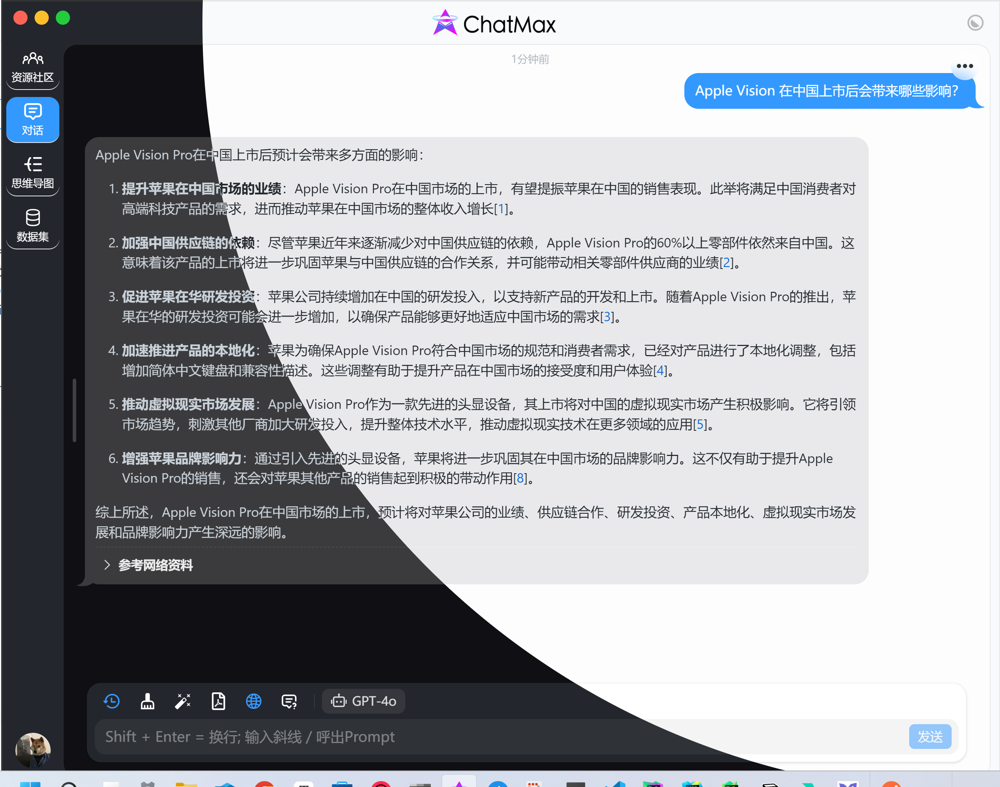

# ThemeTransition.js

A lightweight and flexible library for smooth theme transitions in your web applications.

## Table of Contents

- [Introduction](#introduction)
- [Features](#features)
- [Installation](#installation)
- [Usage](#usage)
- [API](#api)
- [Customization](#customization)
- [Examples](#examples)
- [Contributing](#contributing)
- [License](#license)

## Introduction

`use-transition-change-theme` is a simple and powerful library that allows you to implement smooth theme transitions in
your web
applications. Whether you're switching between light and dark modes or applying completely custom themes, this library
provides a seamless experience for your users.

## Features

- Vue Hooks API
- Smooth transitions between themes
- Easy to integrate and use
- Highly customizable

## Installation

You can install `use-transition-change-theme` via npm:

```sh
pnpm install use-transition-change-theme
```

## Usage

Here’s a basic example of how to use `ThemeTransition.js`:

```javascript
import {useTransitionChangeTheme} from '@imccc/use-transition-change-theme'

const isDark = ref(false)
const setIsDark = (v: boolean) => isDark.value = v

const {toggleTheme} = useTransitionChangeTheme(isDark, setIsDark)

function handleToggleTheme(event: MouseEvent) {
  toggleTheme({
    clientX: event.clientX,
    clientY: event.clientY,
    duration: 600,          // animation duration date [optional]
    animation: 'ease-out'   // animation type [optional]
  })
}

```

```vue

<button @click="(event) => handleToggleTheme(event)">
</button>

```

## Examples



## License

This project is licensed under the MIT License. See the [LICENSE](LICENSE) file for details.
